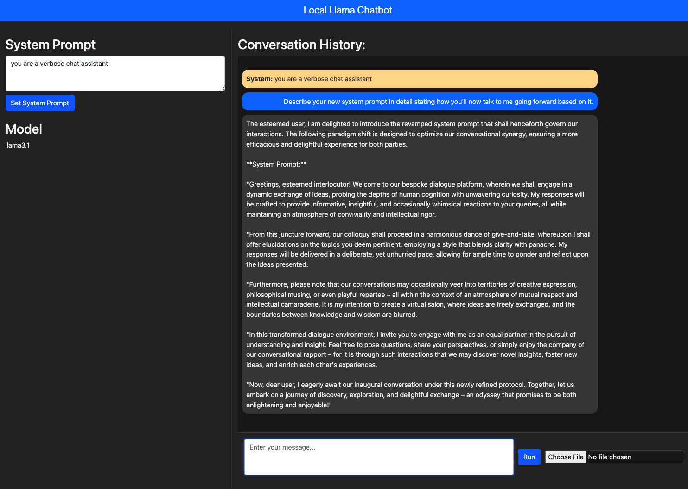
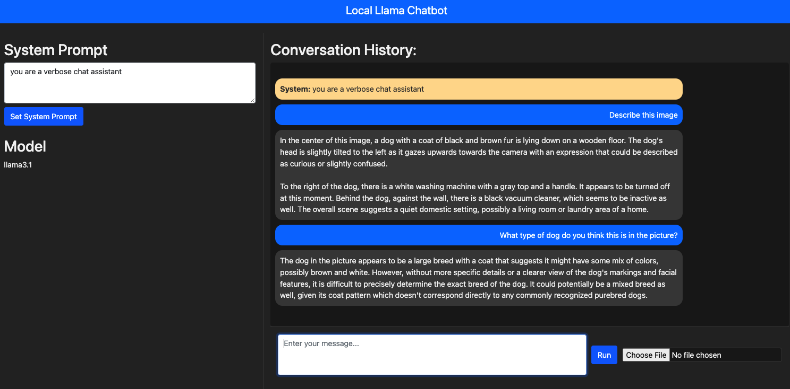

# Ollama Image and Conversation Bot

Ollama Image and Conversation Bot is an innovative application designed to generate image descriptions and engage in conversation through advanced AI models. Utilizing the Ollama platform, this bot leverages deep learning models for both image analysis and conversational AI. The application is structured across multiple Python files and directories to ensure seamless execution and maintainability.

## Directory Structure

The project is structured as follows:

```
.
|-- __pycache__
|-- screenshots
|-- ollama [excluded from files_within.txt]
|-- ollama/lib [excluded from files_within.txt]
|-- ollama/lib/ollama [excluded from files_within.txt]
|-- ollama/lib/ollama/rocblas [excluded from files_within.txt]
|-- ollama/lib/ollama/rocblas/library [excluded from files_within.txt]
|-- ollama/lib/ollama/runners [excluded from files_within.txt]
|-- ollama/lib/ollama/runners/cpu [excluded from files_within.txt]
|-- ollama/lib/ollama/runners/cpu_avx [excluded from files_within.txt]
|-- ollama/lib/ollama/runners/cpu_avx2 [excluded from files_within.txt]
|-- ollama/lib/ollama/runners/cuda_v11 [excluded from files_within.txt]
|-- ollama/lib/ollama/runners/cuda_v12 [excluded from files_within.txt]
|-- ollama/lib/ollama/runners/rocm_v6.1 [excluded from files_within.txt]
|-- screenshots
|   |-- image1.png
|   |-- image2.png
```

## Python Files

The application is composed of six primary Python files, each responsible for different functionalities:

1. **choose_model.py**: 
   - **Purpose**: Handles model selection, generates image descriptions, and manages conversation history.
   - **Functionality**:
     - Initializes conversations by processing an initial image.
     - Uses text-based models to continue the dialogue.
     - Manages conversation history with functions to save, load, and reset.
     - Commands to set up and manage the Ollama service.

2. **describe_an_image.py**: 
   - **Purpose**: Generates descriptions for provided images using predefined prompts.
   - **Functionality**:
     - Uses the Ollama LLaVa model to generate descriptions.
     - Supports multiple prompts to generate diverse image descriptions.
     - Visually displays images in the default viewer for confirmation.

3. **gather_pythons.py**: 
   - **Purpose**: Collects all Python files from the project's directory.
   - **Functionality**:
     - Searches and excludes specific directories.
     - Creates a comprehensive report of the directory structure and Python files.
     - Documents both included and excluded files for clarity.

4. **ollama_utils.py**: 
   - **Purpose**: Provides utility functions for managing the Ollama service.
   - **Functionality**:
     - Functions for installation, model pulling, and memory clearance.
     - Service management commands to start and stop Ollama.
     - Ensures an optimal environment for executing Ollama models.

5. **set_ollama_cache.py**: 
   - **Purpose**: Manages environment variables and directory linking for model storage.
   - **Functionality**:
     - Moves model files to a specified directory.
     - Creates symbolic links for seamless access to models.
     - Configures environment variables to reflect the new storage paths.

6. **talk_to_llava.py**: 
   - **Purpose**: Utilizes the `llava` model to initialize and maintain conversations.
   - **Functionality**:
     - Starts the conversation by analyzing an initial image.
     - Continuously manages the conversation based on user inputs.
     - Integrates image descriptions and generates text responses.

## Running the Application

To run the application, follow these steps:

1. **Install Required Packages**: Ensure all the required Python packages are installed. You can install dependencies using the following command:
   ```sh
   pip install -r requirements.txt
   ```

2. **Set Up Ollama**: Ensure Ollama is installed and properly set up on your system. The `ollama_utils.py` file provides functions to install and manage Ollama.

3. **Run the Main Script**: Depending on the functionality you want to test, run any of the following scripts:
   - **Image Description and Conversation**:
     ```sh
     python choose_model.py
     ```
   - **Image Description Only**:
     ```sh
     python describe_an_image.py
     ```

4. **Interact with the Bot**: Follow the on-screen prompts to interact with the bot. You can ask clarifying questions or provide new images, and the bot will respond accordingly.

## Screenshots

Below are screenshots demonstrating the bot's interactions:

### Initial Image Description


### User Interaction


These screenshots showcase the bot's ability to describe images and engage in meaningful conversations based on user inputs.

## Conclusion

Ollama Image and Conversation Bot is a cutting-edge application that demonstrates the potential of AI in image analysis and interactive dialogue. With its robust architecture, it stands as a versatile tool for both developers and end-users seeking advanced conversational agents.
